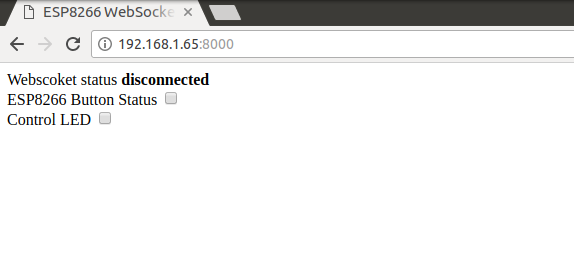

# Dùng FPGA trên DE2 thiết kế IC 74LS138
## Quartus II 13.0sp1_


[](https://travis-ci.org/joemccann/dillinger)
## Mục đích
Nắm được cách mô tả hoạt động của các IC chức năng cơ bản sử dụng FPGA trên DE2.


## Mô phỏng lại IC 74LS283 bằng VHDL 

Gán chân theo mẫu sau:
- Chân A0 đến A3 được nối với SW0 đến SW3
- Chân B0 đến A3 được nối với SW4 đến SW7
- Chân C0 được nối với SW8 
- Chân S0 đến S3 được nối với LED0 đến LED3
- Chân C4 được nối với LED4

```sh
library IEEE;
use IEEE.STD_LOGIC_1164.ALL;
use IEEE.STD_LOGIC_ARITH.ALL;
use IEEE.STD_LOGIC_UNSIGNED.ALL;

entity tn9 is
port(   A: IN STD_LOGIC_VECTOR(3 downto 0);
		B: IN STD_LOGIC_VECTOR(3 downto 0);
		C0: IN STD_LOGIC;
		S: OUT STD_LOGIC_VECTOR(3 downto 0);
		C4: OUT STD_LOGIC
	);
end entity tn9;	

architecture bhv of tn9 is
	signal A_temp: STD_LOGIC_VECTOR(4 downto 0);
	signal B_temp: STD_LOGIC_VECTOR(4 downto 0);
	signal Sum_temp: STD_LOGIC_VECTOR(4 downto 0);
begin
	A_temp <= '0'&A;
	B_temp <= '0'&B;
	Sum_temp <= A_temp + B_temp + C0;
	
	S <= Sum_temp(3 downto 0);
	C4 <= Sum_temp(4);
end architecture bhv;


```
## Sử dụng ESP8266 như Websocket Server
Trong phần này, chúng ta sẽ thiết lập ứng dụng sử dụng ESP8266 như 1 Websocket Server và Trình duyệt như là một Web Socket Client để cập nhật trạng thái nút nhấn, cũng như điều khiển đèn LED trên board thời gian thực thông qua Trình duyệt.

#### Yêu cầu

- Khởi động 1 Webserver (có hỗ trợ Websocket) trên chip ESP8266.

- Khi truy cập vào địa chỉ IP của ESP8266 sẽ trả về 1 file HTML bao gồm nội dung của đoạn Javascript thiết lập kết nối Websocket đến ESP8266 đồng thời lắng nghe các gói tin từ ESP8266 Server.

- Khi nhấn nút trên board ESP8266 sẽ gởi nội dung trạng thái nút nhất đến Web Browser hiển thị dạng hộp kiểm (checkbox), nhấn nút là có kiểm, không nhấn nút là không có kiểm.

- Đồng thời khi nhấn hộp kiểm trên trình duyệt sẽ thay đổi trạng thái đèn LED trên board ESP8266.

#### Chuẩn bị
Cài đặt thư viện, xem thêm Cài đặt thư viện Arduino:

- github.com/me-no-dev/ESPAsyncWebServer

- github.com/me-no-dev/ESPAsyncTCP

#### Giới thiệu về thư viện ESPAsyncWebServer
Thư viện ESPAsyncWebServer dùng cho việc thiết lập HTTP server và websocket server cho module ESP8266, và xử lí các sự kiện trên server-client.

Để các chương trình dùng thư viện ESPAsyncWebserver hoat động, ta cần dùng thêm thư viện ESPAsyncTCP.

#### Đoạn code Javascript để tạo kết nối Web Socket
```sh
//Trình tự mở một websocket cơ bản:

var ws = new WebSocket('ws://domain.com:8000/'); // mở 1 websocket
ws.onopen = function() //
{
   // sự kiện khi websocket được mở thành công
};

ws.onmessage = function(evt)
{
    // sự kiện xảy ra khi client nhận dữ liệu từ server
};
ws.onclose = function() {
    // sự kiện khi websocket bị đóng
};

```

#### Nhúng file HTML chứa đoạn code JS vào ESP8266

```sh
<!DOCTYPE HTML>
<html>
<head>
    <title>ESP8266 WebSocket</title>
</head>
<body>
    <div> Webscoket status <span id="status" style="font-weight: bold;"> disconnected </span> </div>
    <div> ESP8266 Button Status <input type="checkbox" id="btn" name="btn" /> </div>
    <div> Control LED <input type="checkbox" id="led" name="led" disabled="true" /> </div>

    <script type="text/javascript">
        var button = document.getElementById('btn');
        var led = document.getElementById('led');
        var url = window.location.host; // hàm trả về url của trang hiện tại kèm theo port
        var ws = new WebSocket('ws://' + url + '/ws'); // mở 1 websocket với port 8000
        ws.onopen = function() //khi websocket được mở thì hàm này sẽ được thưc hiện
        {
            document.getElementById('status').innerHTML = 'Connected';
            led.disabled = false; //khi websocket được mở, mới cho phép
        };

        ws.onmessage = function(evt) // sự kiện xảy ra khi client nhận dữ liệu từ server
        {
            if(evt.data == 'BTN_PRESSED') {
                button.checked = true;
            } else if(evt.data == 'BTN_RELEASE') {
                button.checked = false;
            }
        };
        ws.onclose = function() { // hàm này sẽ được thực hiện khi đóng websocket
            led.disabled = true;
            document.getElementById('status').innerHTML = 'Disconnected';
        };

        led.onchange = function() { // thực hiện thay đổi bật/tắt led
            var status = 'LED_OFF';
            if (led.checked) {
                status = 'LED_ON';
            }
            ws.send(status)
        }

    </script>
</body>
</html>
```

#### Chương trình hoàn chỉnh cho ESP8266 (Viết bằng C++)
```sh

#include <ESP8266WiFi.h>
#include <ESPAsyncWebServer.h>

const char* ssid = "******";
const char* password = "*********";
const int LED = 16;
const int BTN = 0;

// để đưa đoạn code HTML vào chương trình Arduino, cần chuyển đổi code HTML sang dạng char

const char index_html[] PROGMEM = ""
"<!DOCTYPE HTML>"
"<html>"
"<head>"
"    <title>ESP8266 WebSocket</title>"
"</head>"
"<body>"
"    <div> Webscoket status <span id=\"status\" style=\"font-weight: bold;\"> disconnected </span> </div>"
"    <div> ESP8266 Button Status <input type=\"checkbox\" id=\"btn\" name=\"btn\" /> </div>"
"    <div> Control LED <input type=\"checkbox\" id=\"led\" name=\"led\" disabled=\"true\" /> </div>"
"    <script type=\"text/javascript\">"
"        var button = document.getElementById('btn');"
"        var led = document.getElementById('led');"
"        var status = document.getElementById('status');"
"        var url = window.location.host;"
"        var ws = new WebSocket('ws://' + url + '/ws');"
"        ws.onopen = function()"
"        {"
"            status.text = 'Connected';"
"            led.disabled = false;"
"        };"
"        ws.onmessage = function(evt)"
"        {"
"            if(evt.data == 'BTN_PRESSED') {"
"                button.checked = true;"
"            } else if(evt.data == 'BTN_RELEASE') {"
"                button.checked = false;"
"            }"
"        };"
"        ws.onclose = function() {"
"            led.disabled = true;"
"            status.text = 'Disconnected';"
"        };"
"        led.onchange = function() {"
"            var status = 'LED_OFF';"
"            if (led.checked) {"
"                status = 'LED_ON';"
"            }"
"            ws.send(status)"
"        }"
"    </script>"
"</body>"
"</html>";

AsyncWebServer server(8000);
AsyncWebSocket ws("/ws");


// Hàm xử lí sự kiện trên Server khi client là browser phát sự kiện
void onWsEvent(AsyncWebSocket * server, AsyncWebSocketClient * client, AwsEventType type, void * arg, uint8_t *data, size_t len) {
  if (type == WS_EVT_DATA && len > 0) { // type: loại sự kiện mà server nhận được. Nếu sự kiện nhận được là từ websocket thì bắt đầu xử lí
    data[len] = 0;
    String data_str = String((char*)data); // ép kiểu, đổi từ kiểu char sang String
    if (data_str == "LED_ON") {
      digitalWrite(LED, 0); // Khi client phát sự kiện "LED_ON" thì server sẽ bật LED
    } else if (data_str == "LED_OFF") {
      digitalWrite(LED, 1); // Khi client phát sự kiện "LED_OFF" thì server sẽ tắt LED
    }
  }

}
void setup()
{
  pinMode(LED, OUTPUT);
  pinMode(BTN, INPUT);
  Serial.begin(115200);
  Serial.setDebugOutput(true);
  WiFi.mode(WIFI_AP_STA);
  WiFi.begin(ssid, password);
  if (WiFi.waitForConnectResult() != WL_CONNECTED) {
    Serial.printf("STA: Failed!\n");
    WiFi.disconnect(false);
    delay(1000);
    WiFi.begin(ssid, password);
  }


  ws.onEvent(onWsEvent); // gọi hàm onWsEvent
  server.addHandler(&ws);
  server.on("/", HTTP_GET, [](AsyncWebServerRequest * request) {

    request->send_P(200, "text/html", index_html); // trả về file index.html trên giao diện browser khi browser truy cập vào IP của server
  });
    server.begin(); // khởi động server

}


void loop()
{
  static bool isPressed = false;
  if (!isPressed && digitalRead(BTN) == 0) { //Nhấn nút nhấn GPIO0
    isPressed = true;
    ws.textAll("BTN_PRESSED");
  } else if (isPressed && digitalRead(BTN)) { //Nhả nút nhấn GPIO0
    isPressed = false;
    ws.textAll("BTN_RELEASE");
  }
}
```
Thực hiện sau khi kiểm tra mã nguồn:

- Chọn Board ESP8266 WiFi Uno trong Arduino IDE

- Nạp chương trình xuống board dùng Arduino IDE

Kết quả
Sau khi biên dịch xong code trên Arduino, ta vào browser, truy cập vào địa chỉ IP của ESP8266 đã trả về trên Serial Monitor cùng với port đã thiết lập trên server, ở trường hợp này là 192.168.1.65:8000



## Sử dụng con chip ESP8266 như Websocket Client

Trong một số ứng dụng khác, chúng ta có 1 Server Websocket để thực hiện các tác vụ thời gian thực như Ứng dụng điện thoại, trình duyệt Web. Thì ESP8266 có thể kết nối trực tiếp vào các server này như 1 Websocket Client để tiếp nhận, hoặc gởi thông tin thông qua Websocket.

Một số dịch vụ sử dụng Websocket điển hình như dịch vụ tin nhắn Slack, dịch vụ cơ sở dữ liệu thời gian thực Firebase

Ở phần này, chúng ta sẽ sử dụng Node.js để tự xây dựng 1 Web server, vừa đóng vai trò là 1 Websocket Server. Có những tính năng:

- Có thể cung cấp file index.html chứa các đoạn mã javascript tạo kết nối Websocket giữa trình duyệt với Server, giống như phần Server Nodejs

- Cho phép kết nối Websocket đến, bao gồm từ trình duyệt, hay từ ESP8266

- Server sẽ broadcast tất cả các gói tin từ bất kỳ 1 client nào gởi đến, tới tất cả các client còn lại.

Với tính năng như trên thì bạn có thể hình dung như sau: Nếu 1 cửa sổ trình duyệt có kết nối Websocket đến Server, khi nhấn 1 nút kiểm, thì sẽ gởi về server trạng thái của nút kiểm đó. Ví dụ LED_ON, server nhận được sẽ gởi dữ liệu LED_ON đến các trình duyệt còn lại (hoặc bao gồm cả ESP8266), và trình duyệt còn lại sẽ hiển thị trạng thái nút kiểm này đang bật.

#### Javascript Websocket Client trên trình duyệt

Với file ```sh index.html ``` có chứa mã nguồn Javascript tạo kết nối đến Websocket, để cùng thư mục với file ```sh server.js ```
```sh
<!DOCTYPE HTML>
<html>
<head>
    <title>ESP8266 WebSocket</title>
</head>
<body>
    <div> Webscoket status <span id="status" style="font-weight: bold;"> disconnected </span> </div>
    <div> ESP8266 Button Status <input type="checkbox" id="btn" name="btn" /> </div>
    <div> Control LED <input type="checkbox" id="led" name="led" disabled="true" /> </div>

    <script type="text/javascript">
        var button = document.getElementById('btn');
        var led = document.getElementById('led');
        var url = window.location.host; // hàm trả về url của trang hiện tại kèm theo port
        var ws = new WebSocket('ws://' + url + '/ws'); // mở 1 websocket với port 8000
        console.log('connecting...')
        ws.onopen = function() //khi websocket được mở thì hàm này sẽ được thưc hiện
        {
            document.getElementById('status').innerHTML = 'Connected';
            led.disabled = false; //khi websocket được mở, mới cho phép
            console.log('connected...')
        };

        ws.onmessage = function(evt) // sự kiện xảy ra khi client nhận dữ liệu từ server
        {
            console.log(evt.data)
            if(evt.data == 'BTN_PRESSED') {
                button.checked = true;
            } else if(evt.data == 'BTN_RELEASE') {
                button.checked = false;
            } else if(evt.data == 'LED_OFF') {
                led.checked = false;
            } else if(evt.data == 'LED_ON') {
                led.checked = true;
            }
        };
        ws.onclose = function() { // hàm này sẽ được thực hiện khi đóng websocket
            led.disabled = true;
            document.getElementById('status').innerHTML = 'Connected';
        };

        led.onchange = function() { // thực hiện thay đổi bật/tắt led
            var led_status = 'LED_OFF';
            if (led.checked) {
                led_status = 'LED_ON';
            }
            ws.send(led_status)
        }

    </script>
</body>
</html>

``` 

## Các chế độ cấu hình WiFi
Thông thường, khi bắt đầu kết nối wifi cho ESP8266, ta phải cấu hình cho thiết bị các thông số của Access Point cũng như SSID và password nếu mạng wifi được thiết lập các bảo mật như WEP/WPA/WPA2. Tuy nhiên, các ứng dụng nhúng sử dụng Wi-fi thường ít chú trọng đến giao diện người dùng (user interface), không có bàn phím hay touchscreen,.. để giao tiếp. Vì thế, mỗi khi muốn kết nối thiết bị ESP với một Access Point nào đó, bạn cần phải có một máy tính đã cài đặt sẵn phần mềm biên dịch, tiếp theo là viết code cấu hình lại thông số wifi cho thiết bị, sau đó nạp code cho thiết bị thông qua một cable USB.

Điều này làm cho việc kết nối wifi trở nên khá bất tiện và phức tạp. Do vậy ESP8266 cung cấp các phương pháp thay thế khác giúp đơn giản hóa việc kết nối trạm ESP (chế độ Station) với một điểm truy cập. Đó là kết nối bằng ```sh SmartConfig```, ```sh WPS ``` hay ```sh Wifi Manager```.

### Smartconfig
#### Kiến thức


SmartConfig là một giao thức được tạo ra nhằm cấu hình cho các thiết bị kết nối với mạng WiFi một cách dễ dàng nhất bằng smart phone. Nói một cách đơn giản, để kết nối WiFi cho thiết bị ESP8266, ta chỉ cần cung cấp thông tin mạng wifi (bao gồm SSID và password) cho ESP thông qua 1 ứng dụng trên smart phone.

[](./picture/7.png)
Chúng ta nên biết rằng, khi 1 điện thoại thông minh đã kết nối vào mạng WiFi có mật khẩu, thì toàn bộ dữ liệu trao đổi giữa Điện thoại và đầu mối khác trong mạng sẽ được mã hóa. Nghĩa là các thiết bị chưa được kết nối mạng và không có mật khẩu thì không thể giải mã được dữ liệu. Vậy làm thế nào để Ứng dụng trên điện thoại gởi thông tin kết nối này đến 1 thiết bị khác chưa hề kết nối mạng. Để làm được điều này, thì nhờ vào 2 đặc điểm sau:

- ESP8266 có khả năng lắng nghe tất cả các gói tin không dây WiFi xung quanh nó, bao gồm cả các gói tin đã được mã hóa.

- Các gói tin gởi trong mạng WiFi được mã hóa và không thể đọc được nội dung, tuy nhiên độ dài gói tin là một hằng số. Ví dụ, gói tin A chưa mã hóa có chiều dài là x, khi mã hóa gói tin A thành gói tin B, thì gói tin B sẽ có chiều dài là x + n, thì n là hằng số.

Cách thức để giao thức ESPTOUCH thực hiện việc gởi thông tin SSID và mật khầu cho thiết bị như sau:

- ESP8266 sẽ vào chế độ lắng nghe, lần lượt từng kênh.

- Điện thoại phải kết nối vào mạng WiFi được mã hóa.

- Ứng dụng trên điện thoại sẽ tiến hành gởi các gói tin với nội dung bất kỳ, nhưng có độ dài n theo từng ký tự của SSID và mật khẩu. Ví dụ, ssid của mạng là mynetwork thì sẽ có ký tự m, với ký tự ascii = 109, Ứng dụng sẽ gởi gói tin có độ dài 109 với nội dung bất kỳ, và lặp lại cho đến hết ký tự k, cũng như mật khẩu, và các ký tự khác như CRC.

- Có thể giao thức ESPTOUCH sẽ mã hóa cả các thông số gởi đi, nhưng vẫn giữ nguyên tắc như trên.

- ESP8266 sẽ phát hiện ra các gói tin với độ dài thay đổi này và ghép nối lại thành SSID và password để kêt nối vào mạng.

- Khi ESP8266 kết nối thành công đến mạng, ESP8266 sẽ kết nối đến IP của Điện thoại, được cung cấp thông qua ESPTOUCH, và gởi thông tin kết nối thành công đến ứng dụng trên điện thoại.
[](./picture/8.png)

#### Thực hiện SmartConfig với ESP8266
Trước tiên, ta sẽ nạp chương trình cho ESP8266. Điểm mấu chốt trong chương trình này chính là hàm WiFi.beginSmartConfig() được cung cấp trong thư viện ESP8266WiFi. Hàm này cho phép thiết bị khởi động chế độ SmartConfig, thu thập các thông tin từ các gói tin và giải mã chúng để có thể kết nối vào mạng Wifi.

Sau khi nạp xong chương trình, ta nhấn giữ button (GPIO0) trong 3s để thiết bị đi vào chế độ smartconfig. (Lúc này bạn sẽ thấy led trên board nhấp nháy nhanh hơn). Dùng smart phone của bạn truy cập vào wifi muốn kết nối, sau đó mở ứng dụng smartconfig và nhập các thông tin SSID và PASSWORD (nếu có) của wifi. Nhấn CONFIRM để xác nhận.

#### Code 
```sh 
#include <Arduino.h>
#include <ESP8266WiFi.h>
#include <Ticker.h>
#include <time.h>

#define PIN_LED 16
#define PIN_BUTTON 0

#define LED_ON() digitalWrite(PIN_LED, HIGH)
#define LED_OFF() digitalWrite(PIN_LED, LOW)
#define LED_TOGGLE() digitalWrite(PIN_LED, digitalRead(PIN_LED) ^ 0x01)

Ticker ticker;

/* Hàm kiểm tra trạng thái của button*/
bool longPress()
{
  static int lastPress = 0;
  if (millis() - lastPress > 3000 && digitalRead(PIN_BUTTON) == 0) { // Nếu button được nhấn và giữ trong 3s thì
    return true;                  // trả về "true".
  } else if (digitalRead(PIN_BUTTON) == 1) { // Nếu button không được nhấn và giữ đủ 3s thì
    lastPress = millis();         // gán biến lastPress bằng thời điểm khi gọi hàm, và trả về "false".
  }                               //
  return false;                   //
}

void tick()
{
  int state = digitalRead(PIN_LED); // Lấy trạng thái hiện tại của LED (GPIO16)
  digitalWrite(PIN_LED, !state);  // Đảo trạng thái LED.
}

bool in_smartconfig = false;      // Biến trạng thái kiểm tra thiết bị có đang trong chế độ smartconfig hay không.

/* Vào chế độ Smartconfig*/
void enter_smartconfig()
{
  if (in_smartconfig == false) {  // Kiểm tra tra biến trạng thái, nếu không ở chế độ smartconfig thì
    in_smartconfig = true;        // Gán biến trạng thái bằng "true", nghĩa là đang trong smartconfig
    ticker.attach(0.1, tick);     // Nhấp nháy led chu kì 0.1s.
    WiFi.mode(WIFI_STA);          // Thiết lập kết nối cho thiết bị ở chế độ Station mode
    WiFi.beginSmartConfig();      // Bắt đầu chế độ smartconfig
    Serial.println("Enter smartconfig");  // In thông báo "Enter smartconfig" ra màn hình
  }
}

/* Thoát chế độ smartconfig*/
void exit_smart()
{
  ticker.detach();              // Ngừng nháy led
  LED_ON();                     // Bật LED
  in_smartconfig = false;       // Gán biến trạng thái trở về ban đầu.
  Serial.println("Connected, Exit smartconfig");  // In thông báo ra màn hình.
}

/* Cài đặt các thông số ban đầu*/
void setup() {
  Serial.begin(115200);         // Tốc độ baud = 115200
  Serial.setDebugOutput(true);  // hiển thị các thông tin debug hệ thống lên màn hình qua serial

  pinMode(PIN_LED, OUTPUT);     // Cấu hình GPIO cho các chân LED và button
  pinMode(PIN_BUTTON, INPUT);   // Chớp tắt led chu kì 1s
  Serial.println("Setup done"); // In thông báo đã cài đặt xong
}

/* Chương trình chính*/
void loop() {
  if (longPress()) {            // Gọi hàm longPress kiểm tra trạng thái button
    enter_smartconfig();        // Nếu button được nhấn giữ trong 3s thì vào trạng thái smartconfig
  }
  if (WiFi.status() == WL_CONNECTED && in_smartconfig && WiFi.smartConfigDone()) { //Kiểm tra trạng thái kết nối wifi,
                                // các thông số cấu hình cũng như trạng thái smartconfig
    exit_smart();               // khi thiết bị đã hết nối wifi thành công, thoát chế độ smartconfig
  }
  if (WiFi.status() == WL_CONNECTED) {
    //Chương trình của bạn khi thiết bị đã được kết nối wifi
  }
}

```


## Tổng kết 
Việc sử dụng giao thức websocket sẽ có nhiều lợi ích cho các kết nối 2 chiều, luôn được duy trì và có độ trễ thấp.
Giúp nắm được các giao thức protocol và các IC chức năng. 

Để triển khai một ứng dụng IoT thực tế thì đòi hỏi rất nhiều vấn đề, một trong số những điều quan trọng là dễ dùng, dễ cấu hình cho người sử dụng và phải bảo mật trong quá trình cung cấp thông tin cho thiết bị. Tùy thuộc vào nhu cầu phát triển sản phẩm và tính năng của sản phẩm mà bạn có thể lựa chọn cho mình phương pháp cấu hình phù hợp. Ví dụ, nếu thiết bị có nút nhấn và có phần mềm trên điện thoại, thì SmartConfig và WPS là một sự lựa chọn. Nếu là 1 bóng đèn trống trơn không có gì cả, thì WiFiManager lại hữu hiệu. 

## Lời kết.
Mặc dù đã cố gắng để hoàn thành tốt nhất nội dung cho blog này, tuy nhiên vẫn không tránh khỏi những thiếu sót. Mọi ý kiến đóng góp xin gửi mail về địa chỉ nhat.tranminh@hcmut.edu.vn
 ## Giấy phép sử dụng tài liệu.
Tài liệu tuân theo giấy phép CC-BY-NC-SA (creativecommons.org/licenses/by-nc-sa/4.0/legalcode)
 

## License

MIT
