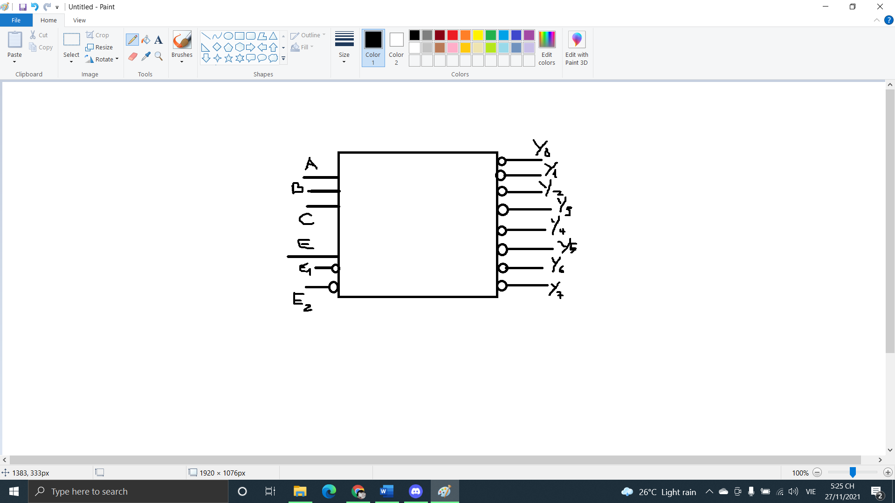
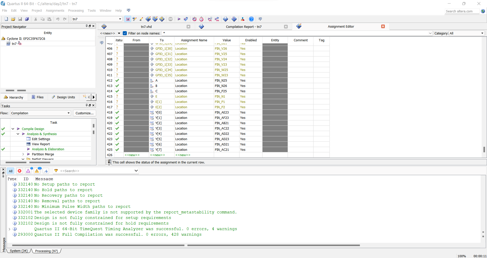
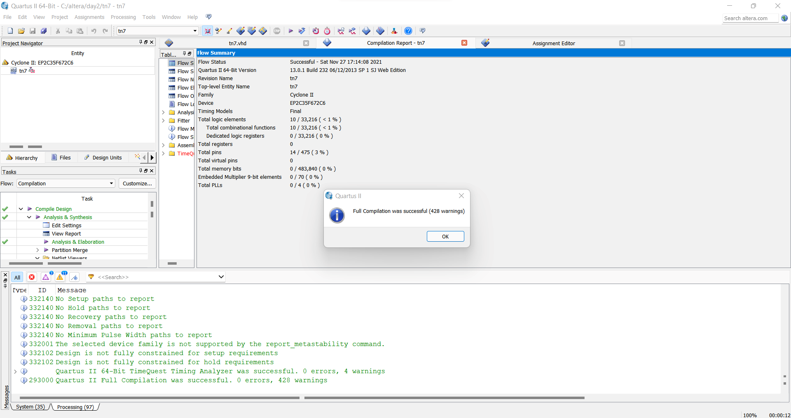
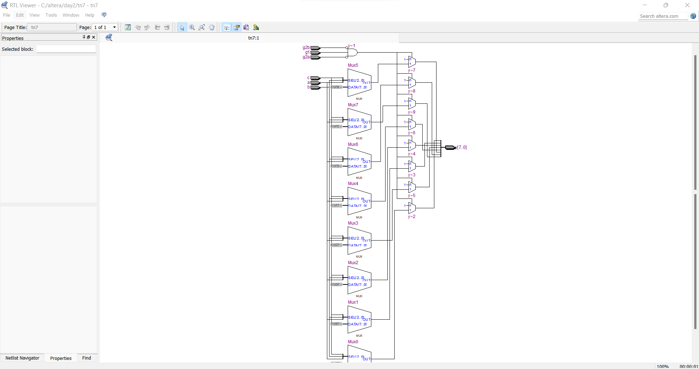
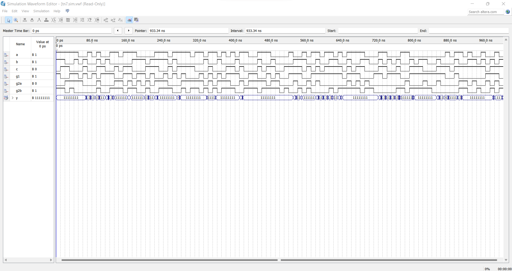

# Dùng FPGA trên DE2 thiết kế IC 74LS138
## Quartus II 13.0sp1_


[](https://travis-ci.org/joemccann/dillinger)
## Mục đích
Nắm được cách mô tả hoạt động của các IC chức năng cơ bản sử dụng FPGA trên DE2.

## Yêu cầu
Mô tả lại IC 74LS138 bằng VHDL và đổ chương trình xuống kit DE2 để kiểm tra hoạt động.
Gán chân theo mẫu sau:
- Chân A được nối với SW0
- Chân B được nối với SW1
- Chân C được nối với SW2
- Chân Y0 đến Y7 được nối với LED0 đến LED7
- Chân E,E1,E2 được nối với SW10, SW11, SW12
## Lí thuyết một số IC chức năng
| Mã IC | Mã trên Proteus | Chức năng IC |
| ------ | ------ | ------ |
| 74LS138 | 74LS138 | Bộ giải mã 3 -> 8 |
| 74LS148 | 74LS148 | Bộ mã hóa 8 -> 3 |
| 74LS151 | 74HC151 | Bộ MUX 8 -> 1 | 
| 74LS47 | 74LS47 | IC giải mã BCD sang led 7 đoạn anode chung |
| 74LS85 | 74LS85 | IC so sánh 2 số nhị phân 8 bit |
| 74LS283 | 74LS283 | IC cộng nhị phân 4 bit |
## Thiết kế
* Sơ đồ khối dự định thiết kế:




* Chương trình VHDL mô tả hoạt động
```sh
LIBRARY ieee;
USE ieee.std_logic_1164.all;
ENTITY tn7 IS
PORT ( c, b, a : IN STD_LOGIC;
g1,g2a,g2b: IN STD_LOGIC;
y : OUT STD_LOGIC_VECTOR(7 downto 0));
END tn7;
ARCHITECTURE flow OF tn7 IS
SIGNAL data: STD_LOGIC_VECTOR(2 downto 0);
SIGNAL temp: STD_LOGIC_VECTOR(7 downto 0);
BEGIN
data <= c & b & a;
WITH data SELECT temp <= "11111110" WHEN "000" ,
"11111101" WHEN "001" ,
"11111011" WHEN "010" ,
"11110111" WHEN "011" ,
"11101111" WHEN "100" ,
"11011111" WHEN "101" ,
"10111111" WHEN "110" ,
"01111111" WHEN "111" ,
"11111111" WHEN OTHERS;
y <= temp WHEN (g1 AND NOT g2a AND NOT g2b) = '1'
ELSE "11111111";
END flow;

```
* Kết quả chụp màn hình gán chân tương ứng với yêu cầu gán chân:



* Hình chụp màn hình minh chứng cho việc biên dịch code thành công.



* Kết quả RTL viewer



* Dạng sóng thu được khi mô phỏng




## Thiết kế hàm Boolean F(x, y, z)=$sigma(0, 3, 4, 7)$ sử dụng 74LS138

Gán chân theo quy ước sau:
- Chân x được nối với SW0
- Chân y được nối với SW1
- Chân z được nối với SW2	Ngõ ra được nối với LED0 

```sh
library ieee;
use ieee.std_logic_1164.all;

entity IC74138 is 
port(
    A, B, C, G1, G2A, G2B: in std_logic;
	 Y: out std_logic_vector (7 downto 0));
end IC74138;
architecture dataflow of IC74138 is
signal ABC: std_logic_vector (2 downto 0);
signal d: std_logic_vector (7 downto 0);
begin
ABC <= A & B & C;
with ABC select d <= "11111110" when "000",
                "11111101" when "001",
			       "11111011" when "010",
			       "11110111" when "011",
			       "11101111" when "100",
			       "11011111" when "101",
			       "10111111" when "110",
			       "01111111" when others;
y <= d when (G1 and (not G2A) and (not G2B)) = '1'
       else "11111111";
end dataflow;
library ieee;
use ieee.std_logic_1164.all;
entity Example is 
port(
    x, y, z: in std_logic;
	 f: out std_logic);
end Example;	

architecture model of Example is
signal w: std_logic_vector (7 downto 0);
component IC74138 
port(
    A, B, C, G1, G2A, G2B: in std_logic;
	 Y: out std_logic_vector (7 downto 0));
end component;
begin
user1: IC74138 port map (x,y,z,'1','0','0',w);
f <= not((((w(0) and  w(3)) and w(4)) and w(7)));
    end model;
```

## Mô phỏng lại IC 74LS283 bằng VHDL 

Gán chân theo mẫu sau:
- Chân A0 đến A3 được nối với SW0 đến SW3
- Chân B0 đến A3 được nối với SW4 đến SW7
- Chân C0 được nối với SW8 
- Chân S0 đến S3 được nối với LED0 đến LED3
- Chân C4 được nối với LED4

```sh
library IEEE;
use IEEE.STD_LOGIC_1164.ALL;
use IEEE.STD_LOGIC_ARITH.ALL;
use IEEE.STD_LOGIC_UNSIGNED.ALL;

entity tn9 is
port(   A: IN STD_LOGIC_VECTOR(3 downto 0);
		B: IN STD_LOGIC_VECTOR(3 downto 0);
		C0: IN STD_LOGIC;
		S: OUT STD_LOGIC_VECTOR(3 downto 0);
		C4: OUT STD_LOGIC
	);
end entity tn9;	

architecture bhv of tn9 is
	signal A_temp: STD_LOGIC_VECTOR(4 downto 0);
	signal B_temp: STD_LOGIC_VECTOR(4 downto 0);
	signal Sum_temp: STD_LOGIC_VECTOR(4 downto 0);
begin
	A_temp <= '0'&A;
	B_temp <= '0'&B;
	Sum_temp <= A_temp + B_temp + C0;
	
	S <= Sum_temp(3 downto 0);
	C4 <= Sum_temp(4);
end architecture bhv;


```
## Sử dụng ESP8266 như Websocket Server
Trong phần này, chúng ta sẽ thiết lập ứng dụng sử dụng ESP8266 như 1 Websocket Server và Trình duyệt như là một Web Socket Client để cập nhật trạng thái nút nhấn, cũng như điều khiển đèn LED trên board thời gian thực thông qua Trình duyệt.

#### Yêu cầu

- Khởi động 1 Webserver (có hỗ trợ Websocket) trên chip ESP8266.

- Khi truy cập vào địa chỉ IP của ESP8266 sẽ trả về 1 file HTML bao gồm nội dung của đoạn Javascript thiết lập kết nối Websocket đến ESP8266 đồng thời lắng nghe các gói tin từ ESP8266 Server.

- Khi nhấn nút trên board ESP8266 sẽ gởi nội dung trạng thái nút nhất đến Web Browser hiển thị dạng hộp kiểm (checkbox), nhấn nút là có kiểm, không nhấn nút là không có kiểm.

- Đồng thời khi nhấn hộp kiểm trên trình duyệt sẽ thay đổi trạng thái đèn LED trên board ESP8266.

#### Chuẩn bị
Cài đặt thư viện, xem thêm Cài đặt thư viện Arduino:

- github.com/me-no-dev/ESPAsyncWebServer

- github.com/me-no-dev/ESPAsyncTCP

#### Giới thiệu về thư viện ESPAsyncWebServer
Thư viện ESPAsyncWebServer dùng cho việc thiết lập HTTP server và websocket server cho module ESP8266, và xử lí các sự kiện trên server-client.

Để các chương trình dùng thư viện ESPAsyncWebserver hoat động, ta cần dùng thêm thư viện ESPAsyncTCP.

#### Đoạn code Javascript để tạo kết nối Web Socket
```sh
//Trình tự mở một websocket cơ bản:

var ws = new WebSocket('ws://domain.com:8000/'); // mở 1 websocket
ws.onopen = function() //
{
   // sự kiện khi websocket được mở thành công
};

ws.onmessage = function(evt)
{
    // sự kiện xảy ra khi client nhận dữ liệu từ server
};
ws.onclose = function() {
    // sự kiện khi websocket bị đóng
};

```

#### Nhúng file HTML chứa đoạn code JS vào ESP8266

```sh
<!DOCTYPE HTML>
<html>
<head>
    <title>ESP8266 WebSocket</title>
</head>
<body>
    <div> Webscoket status <span id="status" style="font-weight: bold;"> disconnected </span> </div>
    <div> ESP8266 Button Status <input type="checkbox" id="btn" name="btn" /> </div>
    <div> Control LED <input type="checkbox" id="led" name="led" disabled="true" /> </div>

    <script type="text/javascript">
        var button = document.getElementById('btn');
        var led = document.getElementById('led');
        var url = window.location.host; // hàm trả về url của trang hiện tại kèm theo port
        var ws = new WebSocket('ws://' + url + '/ws'); // mở 1 websocket với port 8000
        ws.onopen = function() //khi websocket được mở thì hàm này sẽ được thưc hiện
        {
            document.getElementById('status').innerHTML = 'Connected';
            led.disabled = false; //khi websocket được mở, mới cho phép
        };

        ws.onmessage = function(evt) // sự kiện xảy ra khi client nhận dữ liệu từ server
        {
            if(evt.data == 'BTN_PRESSED') {
                button.checked = true;
            } else if(evt.data == 'BTN_RELEASE') {
                button.checked = false;
            }
        };
        ws.onclose = function() { // hàm này sẽ được thực hiện khi đóng websocket
            led.disabled = true;
            document.getElementById('status').innerHTML = 'Disconnected';
        };

        led.onchange = function() { // thực hiện thay đổi bật/tắt led
            var status = 'LED_OFF';
            if (led.checked) {
                status = 'LED_ON';
            }
            ws.send(status)
        }

    </script>
</body>
</html>
```

#### Chương trình hoàn chỉnh cho ESP8266 (Viết bằng C++)
```sh

#include <ESP8266WiFi.h>
#include <ESPAsyncWebServer.h>

const char* ssid = "******";
const char* password = "*********";
const int LED = 16;
const int BTN = 0;

// để đưa đoạn code HTML vào chương trình Arduino, cần chuyển đổi code HTML sang dạng char

const char index_html[] PROGMEM = ""
"<!DOCTYPE HTML>"
"<html>"
"<head>"
"    <title>ESP8266 WebSocket</title>"
"</head>"
"<body>"
"    <div> Webscoket status <span id=\"status\" style=\"font-weight: bold;\"> disconnected </span> </div>"
"    <div> ESP8266 Button Status <input type=\"checkbox\" id=\"btn\" name=\"btn\" /> </div>"
"    <div> Control LED <input type=\"checkbox\" id=\"led\" name=\"led\" disabled=\"true\" /> </div>"
"    <script type=\"text/javascript\">"
"        var button = document.getElementById('btn');"
"        var led = document.getElementById('led');"
"        var status = document.getElementById('status');"
"        var url = window.location.host;"
"        var ws = new WebSocket('ws://' + url + '/ws');"
"        ws.onopen = function()"
"        {"
"            status.text = 'Connected';"
"            led.disabled = false;"
"        };"
"        ws.onmessage = function(evt)"
"        {"
"            if(evt.data == 'BTN_PRESSED') {"
"                button.checked = true;"
"            } else if(evt.data == 'BTN_RELEASE') {"
"                button.checked = false;"
"            }"
"        };"
"        ws.onclose = function() {"
"            led.disabled = true;"
"            status.text = 'Disconnected';"
"        };"
"        led.onchange = function() {"
"            var status = 'LED_OFF';"
"            if (led.checked) {"
"                status = 'LED_ON';"
"            }"
"            ws.send(status)"
"        }"
"    </script>"
"</body>"
"</html>";

AsyncWebServer server(8000);
AsyncWebSocket ws("/ws");


// Hàm xử lí sự kiện trên Server khi client là browser phát sự kiện
void onWsEvent(AsyncWebSocket * server, AsyncWebSocketClient * client, AwsEventType type, void * arg, uint8_t *data, size_t len) {
  if (type == WS_EVT_DATA && len > 0) { // type: loại sự kiện mà server nhận được. Nếu sự kiện nhận được là từ websocket thì bắt đầu xử lí
    data[len] = 0;
    String data_str = String((char*)data); // ép kiểu, đổi từ kiểu char sang String
    if (data_str == "LED_ON") {
      digitalWrite(LED, 0); // Khi client phát sự kiện "LED_ON" thì server sẽ bật LED
    } else if (data_str == "LED_OFF") {
      digitalWrite(LED, 1); // Khi client phát sự kiện "LED_OFF" thì server sẽ tắt LED
    }
  }

}
void setup()
{
  pinMode(LED, OUTPUT);
  pinMode(BTN, INPUT);
  Serial.begin(115200);
  Serial.setDebugOutput(true);
  WiFi.mode(WIFI_AP_STA);
  WiFi.begin(ssid, password);
  if (WiFi.waitForConnectResult() != WL_CONNECTED) {
    Serial.printf("STA: Failed!\n");
    WiFi.disconnect(false);
    delay(1000);
    WiFi.begin(ssid, password);
  }


  ws.onEvent(onWsEvent); // gọi hàm onWsEvent
  server.addHandler(&ws);
  server.on("/", HTTP_GET, [](AsyncWebServerRequest * request) {

    request->send_P(200, "text/html", index_html); // trả về file index.html trên giao diện browser khi browser truy cập vào IP của server
  });
    server.begin(); // khởi động server

}


void loop()
{
  static bool isPressed = false;
  if (!isPressed && digitalRead(BTN) == 0) { //Nhấn nút nhấn GPIO0
    isPressed = true;
    ws.textAll("BTN_PRESSED");
  } else if (isPressed && digitalRead(BTN)) { //Nhả nút nhấn GPIO0
    isPressed = false;
    ws.textAll("BTN_RELEASE");
  }
}
```
Thực hiện sau khi kiểm tra mã nguồn:

- Chọn Board ESP8266 WiFi Uno trong Arduino IDE

- Nạp chương trình xuống board dùng Arduino IDE

Kết quả
Sau khi biên dịch xong code trên Arduino, ta vào browser, truy cập vào địa chỉ IP của ESP8266 đã trả về trên Serial Monitor cùng với port đã thiết lập trên server, ở trường hợp này là 192.168.1.65:8000


## Sử dụng con chip ESP8266 như Websocket Client

Trong một số ứng dụng khác, chúng ta có 1 Server Websocket để thực hiện các tác vụ thời gian thực như Ứng dụng điện thoại, trình duyệt Web. Thì ESP8266 có thể kết nối trực tiếp vào các server này như 1 Websocket Client để tiếp nhận, hoặc gởi thông tin thông qua Websocket.

Một số dịch vụ sử dụng Websocket điển hình như dịch vụ tin nhắn Slack, dịch vụ cơ sở dữ liệu thời gian thực Firebase

Ở phần này, chúng ta sẽ sử dụng Node.js để tự xây dựng 1 Web server, vừa đóng vai trò là 1 Websocket Server. Có những tính năng:

- Có thể cung cấp file index.html chứa các đoạn mã javascript tạo kết nối Websocket giữa trình duyệt với Server, giống như phần Server Nodejs

- Cho phép kết nối Websocket đến, bao gồm từ trình duyệt, hay từ ESP8266

- Server sẽ broadcast tất cả các gói tin từ bất kỳ 1 client nào gởi đến, tới tất cả các client còn lại.

Với tính năng như trên thì bạn có thể hình dung như sau: Nếu 1 cửa sổ trình duyệt có kết nối Websocket đến Server, khi nhấn 1 nút kiểm, thì sẽ gởi về server trạng thái của nút kiểm đó. Ví dụ LED_ON, server nhận được sẽ gởi dữ liệu LED_ON đến các trình duyệt còn lại (hoặc bao gồm cả ESP8266), và trình duyệt còn lại sẽ hiển thị trạng thái nút kiểm này đang bật.

#### Javascript Websocket Client trên trình duyệt

Với file ```sh index.html ``` có chứa mã nguồn Javascript tạo kết nối đến Websocket, để cùng thư mục với file ```sh server.js ```
```sh
<!DOCTYPE HTML>
<html>
<head>
    <title>ESP8266 WebSocket</title>
</head>
<body>
    <div> Webscoket status <span id="status" style="font-weight: bold;"> disconnected </span> </div>
    <div> ESP8266 Button Status <input type="checkbox" id="btn" name="btn" /> </div>
    <div> Control LED <input type="checkbox" id="led" name="led" disabled="true" /> </div>

    <script type="text/javascript">
        var button = document.getElementById('btn');
        var led = document.getElementById('led');
        var url = window.location.host; // hàm trả về url của trang hiện tại kèm theo port
        var ws = new WebSocket('ws://' + url + '/ws'); // mở 1 websocket với port 8000
        console.log('connecting...')
        ws.onopen = function() //khi websocket được mở thì hàm này sẽ được thưc hiện
        {
            document.getElementById('status').innerHTML = 'Connected';
            led.disabled = false; //khi websocket được mở, mới cho phép
            console.log('connected...')
        };

        ws.onmessage = function(evt) // sự kiện xảy ra khi client nhận dữ liệu từ server
        {
            console.log(evt.data)
            if(evt.data == 'BTN_PRESSED') {
                button.checked = true;
            } else if(evt.data == 'BTN_RELEASE') {
                button.checked = false;
            } else if(evt.data == 'LED_OFF') {
                led.checked = false;
            } else if(evt.data == 'LED_ON') {
                led.checked = true;
            }
        };
        ws.onclose = function() { // hàm này sẽ được thực hiện khi đóng websocket
            led.disabled = true;
            document.getElementById('status').innerHTML = 'Connected';
        };

        led.onchange = function() { // thực hiện thay đổi bật/tắt led
            var led_status = 'LED_OFF';
            if (led.checked) {
                led_status = 'LED_ON';
            }
            ws.send(led_status)
        }

    </script>
</body>
</html>

``` 

## Tổng kết 
Việc sử dụng giao thức websocket sẽ có nhiều lợi ích cho các kết nối 2 chiều, luôn được duy trì và có độ trễ thấp.
Giúp nắm được các giao thức protocol và các IC chức năng

## Lời kết.
Mặc dù đã cố gắng để hoàn thành tốt nhất nội dung cho blog này, tuy nhiên vẫn không tránh khỏi những thiếu sót. Mọi ý kiến đóng góp xin gửi mail về địa chỉ nhat.tranminh@hcmut.edu.vn
 ## Giấy phép sử dụng tài liệu.
Tài liệu tuân theo giấy phép CC-BY-NC-SA (creativecommons.org/licenses/by-nc-sa/4.0/legalcode)
 

## License

MIT
